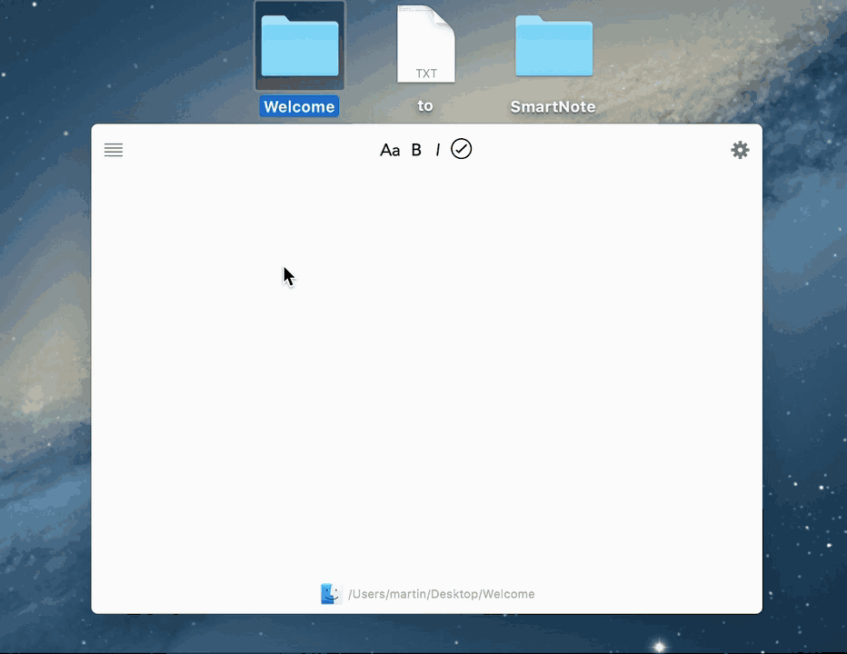

SmartNote
=========

A smarter note app for OSX.

SmartNote allows you to link notes to applications, files, folders and URLs.

A short preview of SmartNote:

### Features:

* Linked notes to system elements
* Textstyles
* Custom system shortcut
* more to come ...

### Requirements
To link notes to system elements, SmartNote uses the Accessibility API of OSX. You will have to enable SmartNote under Security in OSX Preferences.